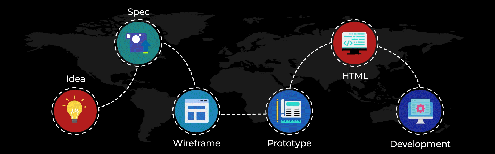

<!-- Banner image -->

<!-- Details about me  -->

# 👋 Hello there! I'm Sazedul Islam – a Passionate Full-Stack Web Developer

🚀 **Building the web, one line at a time.**  
📍 Based in Dhaka, Bangladesh & currently pursuing my BSc in Computer Science at **Southeast University**.  
🖥️ I’ve been **developing full-stack applications** since 2021, turning ideas into beautiful, scalable, and high-performance digital experiences.

🌐 Here is my personal website: [**sazedulislam.netlify.app**](https://www.sazedulislam.netlify.app)

---

### 🔧 What I Love Working On:
- ⚙️ Building robust backend systems with **Node.js, Express & MongoDB**
- 🎨 Designing sleek, responsive UIs with **React, Tailwind CSS & Next.js**
- 🔐 Securing applications with **JWT, Firebase Auth, and OAuth**
- ☁️ Cloud deployment & automation via **Vercel, Netlify, AWS & GCP**
- 🧠 Learning and experimenting with **AI APIs, WebSockets, and GraphQL**

---

### 💡 Fun Facts About Me:
- 🧠 I believe in “learning by building” — side projects are my second nature.
- 🎬 I enjoy editing videos and audio in Adobe Audition and Photoshop during my free time.
- 🌱 Currently learning **GraphQL** and diving deeper into **TypeScript** best practices.
- 🤝 Always happy to collaborate on exciting open-source or freelance projects.

---

### 🔍 What's Next?
I'm currently exploring opportunities to:
- 🌍 Work with teams that solve real-world problems using code.
- 💼 Join a tech-driven startup or freelance team as a full-stack developer.
- ✍️ Share my journey via blogs/tutorials and maybe launch a YouTube channel soon!

---

<!-- viewer count -->
###

  

###

<!-- State -->
###

  
  
  

###

 

<!-- Tech stack -->

# 💻 Tech Stack:
                           
###

<!-- Contact us -->

# 💻 Reach Out to Me:
###

###

  
  
  
  
  
  
  
  

###

 

---

<!--Graph & Trophy -->
###

  

###

  

###

 

---

<!-- Snake & Pacman -->

###

<picture>
  <source media="(prefers-color-scheme: dark)" srcset="https://raw.githubusercontent.com/sazed1237/sazed1237/output/github-snake-dark.svg" />
  <source media="(prefers-color-scheme: light)" srcset="https://raw.githubusercontent.com/sazed1237/sazed1237/output/github-snake.svg" />
  
</picture>

###

 

<picture>
  <source media="(prefers-color-scheme: dark)" srcset="https://raw.githubusercontent.com/sazed1237/sazed1237/output/pacman-contribution-graph-dark.svg">
  <source media="(prefers-color-scheme: light)" srcset="https://raw.githubusercontent.com/sazed1237/sazed1237/output/pacman-contribution-graph.svg">
  
</picture>
